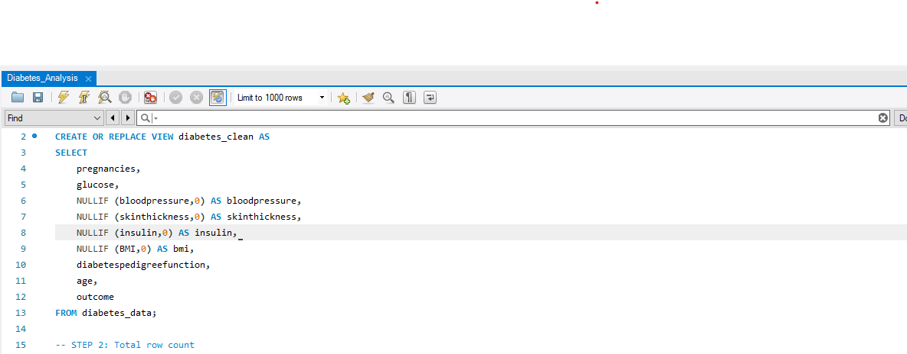
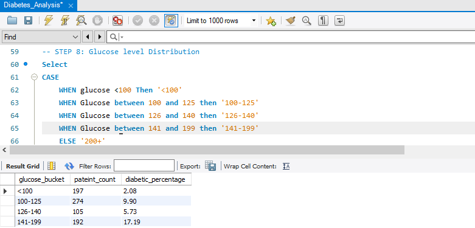
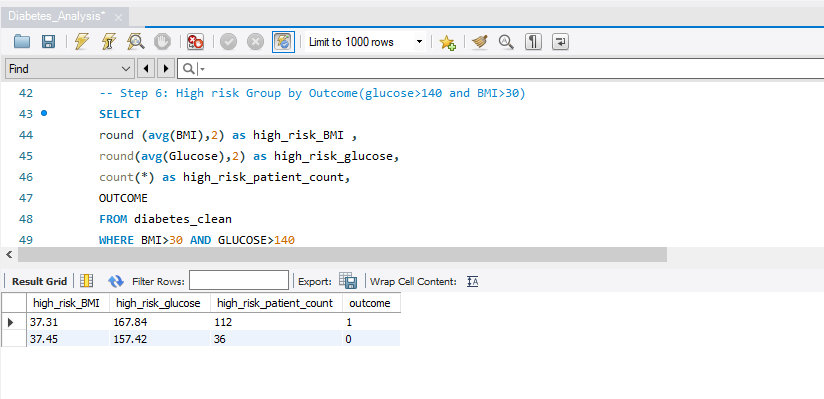
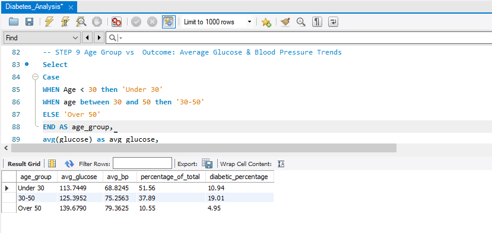
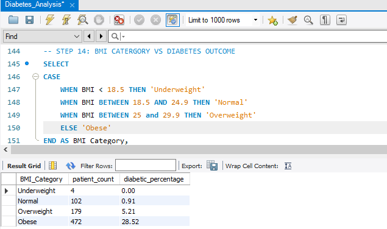
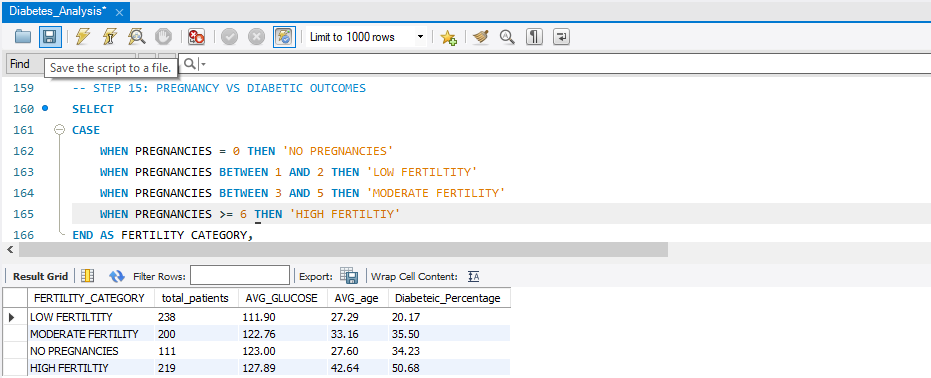
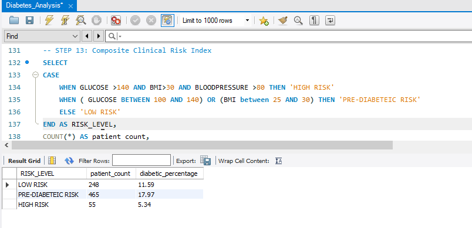

# 🩺 Diabetes Health Data Analysis — SQL Project

## 📘 Overview
This project explores a healthcare dataset focusing on diabetes-related factors such as glucose levels, BMI, insulin, pregnancies, and outcomes.  
The goal was to uncover trends and correlations that could help understand patient risk patterns, clinical outcomes, and possible health interventions.  
All analysis was performed using **MySQL**.

---

## 🧰 Tools Used
- **MySQL Workbench** – for database management and SQL queries  
- **GitHub** – for documentation and version control  

---

## 🧹 Step 1: Data Cleaning and Verification
Ensured the dataset was correctly imported into MySQL, verified column names, and created a clean version of the diabetes dataset by replacing zero values with `NULL` for physiological parameters that cannot logically be zero (such as glucose, insulin, blood pressure, BMI, and skin thickness).  
This ensures that future calculations like averages, counts, and correlations are more accurate and not distorted by invalid placeholder values.

🖼️ *Screenshot:*  

---

## 📊 Step 2: Outcome Distribution
Counted how many patients were classified as diabetic (1) or non-diabetic (0).  
This provided an overview of the population distribution within the dataset.

🖼️ *Screenshot:*  

---

## 📈 Step 3: Glucose Level Distribution  

Plasma glucose values were grouped into clinical buckets to calculate both the **patient count** and the **percentage of individuals diagnosed as diabetic** within each range.  
This approach provides a clear picture of how diabetes diagnoses are distributed across different glucose levels.

The results show that while higher glucose ranges generally corresponded to increased diabetes prevalence, a small subset of patients with **lower glucose levels (<100 and 100–125 mg/dL)** were still recorded as diabetic.  
This may reflect factors such as **ongoing treatment**, **alternate diagnostic criteria** (e.g., HbA1c or OGTT), or **differences in testing context**.

By combining patient counts and diabetic percentages, this analysis illustrates how **real-world clinical data can display diagnostic variation** that may not align perfectly with a single glucose 
🖼️ *Screenshot:*  

---

## 🚨 Step 4: High-Risk Group Analysis
Filtered the dataset to identify individuals with glucose ≥140 mg/dL and BMI>30 (high risk).  
Examined how many were already diagnosed as diabetic, showing possible underdiagnosed pre-diabetic cases.

The results indicated that individuals in this high-risk category exhibited both **higher average glucose** and **higher average BMI** compared to the overall dataset.  
A significant proportion of this group was classified as diabetic, reinforcing the association between **obesity, elevated glucose levels**, and **diabetes prevalence**.

This subset provides a clearer view of the metabolic patterns commonly associated with diabetes and highlights the importance of continuous monitoring and early intervention among patients with elevated glucose readings.

🖼️ *Screenshot:*  

---

## 👶 Step 5: Age Group vs Outcome
Grouped patients by age to identify diabetes prevalence in different age categories.  
This revealed a steady increase in diabetes cases with age.

🖼️ *Screenshot:*  

---

## ⚖️ Step 6: BMI and Diabetic Outcomes  

Body Mass Index (BMI) values were categorized into standard clinical ranges to evaluate how body composition correlates with diabetes outcomes.  
For each BMI category, the **number of patients** and the **percentage diagnosed as diabetic** were calculated.

The analysis revealed a clear trend:  
- **Diabetes prevalence increased progressively** from normal to obese BMI ranges.  
- The **obese group** accounted for the highest proportion of diabetic individuals, consistent with known links between obesity, insulin resistance, and metabolic dysfunction.  

This finding aligns with epidemiological evidence that higher BMI significantly contributes to diabetes risk and demonstrates how SQL-based aggregation can highlight meaningful health trends within patient datasets.

🖼️ *Screenshot:*  

---

## 🤰 Step 7: Pregnancies vs Diabetes Outcome
Analyzed pregnancy counts in relation to diabetes diagnosis.  
A trend showed that women with multiple pregnancies tended to have higher diabetes outcomes, possibly indicating gestational diabetes or hormonal influence.

🖼️ *Screenshot:*  

---

## 💉 Step 8: Insulin vs Glucose Relationship
Compared insulin levels and glucose values to understand insulin resistance trends among diabetic and non-diabetic groups.

🖼️ *Screenshot:*  

---

## 🧮 Step 9: Composite Clinical Risk Index  

A composite clinical risk index was created by combining multiple metabolic factors to classify patients into three categories
For each category, the **patient count** and **percentage diagnosed as diabetic** were calculated to assess how combined physiological factors relate to diabetes outcomes.

Unexpectedly, results showed that the **pre-diabetic risk group** had the **highest percentage of diagnosed diabetics**, while the **high-risk group** had the **lowest diabetic percentage**.  
This pattern highlights a critical observation: many individuals with clinical signs of risk may be **unaware of their diabetic status**, reflecting **underdiagnosis** or **limited health screening**.  
Such findings emphasize the importance of **preventive care, early detection**, and improved access to diagnostic testing, as undiagnosed diabetes can complicate treatment for other health conditions.

This analysis demonstrates how integrating multiple physiological parameters can uncover hidden public health concerns and support more effective health planning and policy decisions.

🖼️ *Screenshot:*  

---

## 🧠 Summary of Key Insights
| Observation | Description |
|--------------|-------------|
| Glucose Patterns | Pre-diabetic ranges (100–125 mg/dL) still included diagnosed diabetics — possibly due to medication or other factors |
| Insulin Relationship | High insulin correlated strongly with elevated glucose |
| Age & BMI | Older and higher-BMI individuals were more likely to be diabetic |
| Pregnancies | Higher pregnancies associated with gestational or hormonal risks |
| Composite Risk | Multi-factor risk index helps identify early warning profiles |

---

## 🩸 Interpretation
While this dataset provides valuable patterns, it lacks details such as medication use, HbA1c, OGTT values or Type 1 or Type 2 Diabetic diagnosis. These missing clinical parameters could explain outliers, such as individuals with low glucose yet diagnosed as diabetic.  
This demonstrates the need for integrated, multi-source clinical data in real-world analysis.

---

## 👩🏾‍🔬 About the Author
**Nontuthuko Nsele**  
Biomedical Scientist | Aspiring Clinical Data Analyst  
Passionate about health research, data analytics, and improving patient outcomes.  
🔗 [LinkedIn](https://linkedin.com/in/nontuthuko-nsele-50173012a)

---
